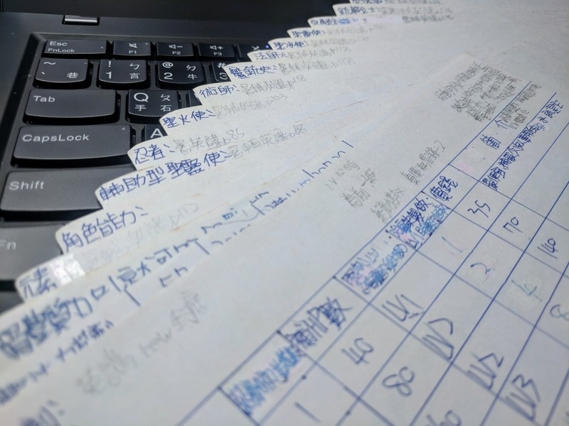

title: 臺北市私立延平高級中學 高中部科系探索實作 資訊領域體驗課程
output: index.html
--

<h1 style="font-size: 72px">
  高中部科系探索實作 
  資訊領域體驗課程
</h1>
 
 

## 臺北市私立延平高級中學
## Denny Huang
## 2024/11/16

--

<h1 style="font-size: 36px">
  https://denny.one/20241116-yphs
</h1>

--

### Who am I ?

 
<h2 style="font-size: 60px">
  <b>Denny Huang</b>
</h2>

* 雷亞遊戲 Rayark Inc. Data Analysis Manager

* <a href="https://sitcon.org/" target="_blank">SITCON 學生計算機年會</a> 共同發起人

* <a href="https://denny.one/" target="_blank">About me</a>

--

# 為什麼選擇 資訊領域？

--

### 國中畢業紀念冊

	

--

	

--

	

--

	

--

# 資訊學群

--

 
## 資訊管理學系 / 資訊科學系 / 資訊工程學系 / 電機資訊學院學士班 / 圖書資訊學系 / 生物機電工程學系 / 多媒體設計系 / 數位科技設計學系 / 資訊管理系 / 資料科學系 / 教育科技學系 / 生物資訊學系 / 人工智慧應用學系 / 資訊與通訊系 / 媒體設計學系 / 資訊經營學系 / 資訊與設計專業學院學士班 / 資訊應用學系

--

# 跨領域

--

# 開發經驗

--

### 核心課程
- 程式語言
- 資料結構
- 演算法

--

# 資訊「工程」

--

# 手機很快沒電 怎麼辦？

--

### 流程
- 觀察與分析
- 設計方案
- 測試與改進
- 實現解決方案

--

# 科學方法

--

	
	<a href="https://zh.wikipedia.org/wiki/File:The_Scientific_Method.svg" target="_blank">src</a>

--

# 軟體工程？

--

# 軟體危機

--

 
<h2 style="font-size: 70px">
系統性 
規範化 
可定量的程序化方法
</h2>

	<a href="http://zh.wikipedia.org/zh-tw/%E8%BD%AF%E4%BB%B6%E5%B7%A5%E7%A8%8B" target="_blank">wiki</a>

--

* Request and Analysis Phase（需求與分析階段）

* Design Phase（設計階段）

* Coding Phase （撰寫階段）

* Testing Phase（測試階段）

* Maintenance Phase （維護階段）

--

# 開放原始碼

--

<iframe width="780" height="500" src="https://www.youtube.com/embed/6NhyCXJU-IQ" frameborder="0" allowfullscreen></iframe>

  
     By Bit Blueprint / Jimmy Huang
  

--

# [大教堂和市集](https://zh.wikipedia.org/wiki/%E5%A4%A7%E6%95%99%E5%A0%82%E5%92%8C%E5%B8%82%E9%9B%86)

--

# [SITCON 社群指南](https://sitcon.org/community-guide/)

--

# 版本控制

--

# Git
## [Git 教學](https://www.youtube.com/watch?v=eznLhINAvQI) / [協作不想吵架？快用版本控制系統](https://www.youtube.com/watch?v=-mcjQxoyaEI)

--

# [開源社群推廣目錄](https://hackmd.io/@SITCON/floss-community-list)

--

# 駭客

--

# 資訊安全

--

### 基本資安議題
- 密碼安全
- 釣魚攻擊與社交工程
- 個人資料與隱私保護
- 基礎網路安全
- 惡意軟體與防範

--

# CVE-2017-0144
## EternalBlue

--

<h1 style="font-size:72px">Thanks for listening</h1>

 

<h2 style="font-size: 18px">
本投影片採用<a href="https://creativecommons.org/licenses/by-sa/4.0/deed.zh-hant" target="_blank">創用 CC「姓名標示-相同方式分享 4.0 國際」授權條款</a>
</h2>
